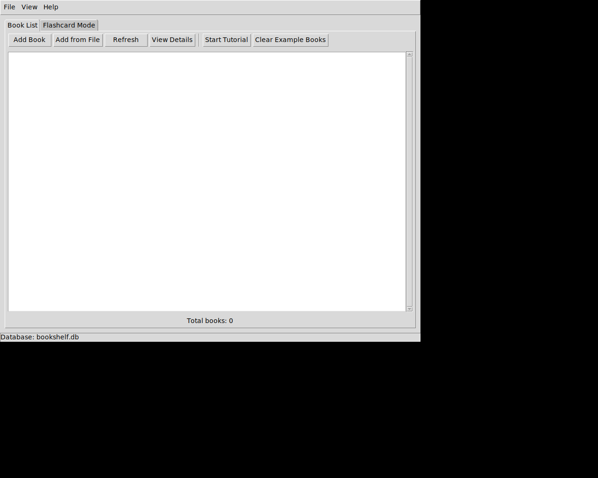
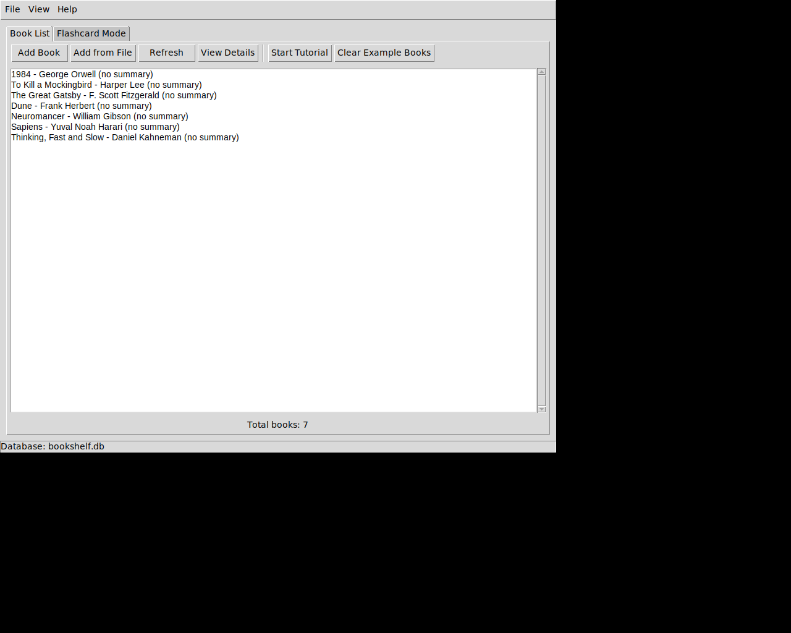

# Tutorial Mode

Bookshelf Flashcards now includes an interactive tutorial mode to help new users get started quickly!

## Features

### 🎓 Start Tutorial
The tutorial automatically loads example books from `example_books.txt` and provides guidance on how to use the application.

**Access the tutorial via:**
- Help menu → Start Tutorial
- Book List toolbar → Start Tutorial button

### 📚 What the Tutorial Does

1. **Loads Example Books**: Automatically adds 7 example books from classic literature, science fiction, and non-fiction
2. **Provides Guided Instructions**: Shows you how to:
   - View books in the Book List tab
   - View book details and summaries
   - Add your own books
   - Use Flashcard Mode for review
3. **Safe Experimentation**: You can add your own books alongside the examples

### 🧹 Clear Example Books
When you're done learning, easily remove all tutorial books with a single click!

**Access via:**
- Book List toolbar → Clear Example Books button

This removes only the books from `example_books.txt`, keeping any books you added yourself.

## Example Books Included

The tutorial includes these popular books:
- **Classic Literature**: 1984, To Kill a Mockingbird, The Great Gatsby
- **Science Fiction**: Dune, Neuromancer
- **Non-Fiction**: Sapiens, Thinking Fast and Slow

## How to Use

### First Time Users

1. Launch the application: `python3 main.py`
2. Click "Start Tutorial" (in toolbar or Help menu)
3. Click "Yes" to load example books
4. Follow the on-screen instructions
5. Experiment with the features
6. When done, click "Clear Example Books"

### For Existing Users

If you already have books in your bookshelf, the tutorial will:
- Skip any example books that are already in your collection
- Add only new example books
- Not affect your existing books when clearing examples

## Screenshots

### Tutorial Buttons in Toolbar

The toolbar now includes "Start Tutorial" and "Clear Example Books" buttons.

### After Loading Example Books

The tutorial loads 7 example books that you can experiment with.

## Implementation Details

The tutorial feature is implemented in `bookshelf_gui.py` with two main methods:

- `_start_tutorial()`: Loads example books and shows guidance
- `_clear_example_books()`: Removes tutorial books while preserving user-added books

The feature uses the existing `example_books.txt` file that was already in the repository, making it a natural extension of the application's existing functionality.
